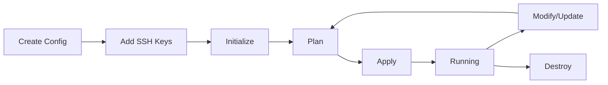

# Parallel Sessions Guide

This guide explains how to run multiple Kubernetes lab sessions in parallel, each with different configurations.

## Table of Contents

1. [Overview](#overview)
2. [Architecture](#architecture)
3. [Quick Start](#quick-start)
4. [Session Management](#session-management)
5. [Configuration Options](#configuration-options)
6. [Parallel Deployment](#parallel-deployment)
7. [Cost Tracking](#cost-tracking)
8. [Troubleshooting](#troubleshooting)

## Overview

The parallel sessions feature allows you to run multiple independent Kubernetes lab environments simultaneously. Each session can have:

- **Different cluster sizes**: One session with 0 workers, another with 5 workers
- **Different instance types**: Small instances for testing, larger for production simulation
- **Different participants**: Separate SSH keys and access per session
- **Independent lifecycles**: Deploy, modify, and destroy sessions independently
- **Cost tracking**: Track costs per session using AWS tags

### Use Cases

- **Training Sessions**: Run multiple training cohorts simultaneously
- **Testing**: Test different configurations side-by-side
- **Multi-Team Labs**: Separate environments for different teams
- **Gradual Rollout**: Deploy new configurations while keeping old ones running

## Architecture

### Workspace-Based Isolation

Each session uses a Terraform workspace to maintain separate state:

```
terraform.tfstate.d/
├── session-1/
│   └── terraform.tfstate
├── session-2/
│   └── terraform.tfstate
└── session-3/
    └── terraform.tfstate
```

### Shared VPC, Isolated Clusters

- **VPC**: Single shared VPC (10.0.0.0/16) across all sessions
- **Security Groups**: Per-participant, per-session isolation
- **Pod Networks**: Unique CIDR per participant (10.100.0.0/16 - 10.255.0.0/16)
- **Resources**: All EC2 instances, key pairs, etc. are session-scoped

### Directory Structure

```
kubernetes-aws-lab/
├── sessions/                    # Session configurations
│   ├── session-1.tfvars        # Config for session 1
│   ├── session-2.tfvars        # Config for session 2
│   └── session-3.tfvars        # Config for session 3
│
├── participants/                # Participant SSH keys
│   ├── session-1/              # Keys for session 1
│   │   ├── alice.pub
│   │   └── bob.pub
│   ├── session-2/              # Keys for session 2
│   │   └── charlie.pub
│   └── session-3/              # Keys for session 3
│       └── diana.pub
│
├── terraform/                   # Terraform code
│   ├── main.tf
│   ├── variables.tf
│   ├── backend.tf              # Backend configuration
│   └── modules/
│
└── scripts/
    └── manage-session.sh       # Session management script
```

## Quick Start

### 1. List Available Sessions

```bash
./scripts/manage-session.sh list
```

Output:
```
Available session configurations:

  ● session-1
    Config: Master (t3.medium) + 0 workers (t3.small)
    Participants: No participants

  ● session-2
    Config: Master (t3.medium) + 2 workers (t3.small)
    Participants: No participants

  ● session-3
    Config: Master (t3.large) + 5 workers (t3.medium)
    Participants: No participants
```

### 2. Prepare a Session

```bash
# Create participant directory
mkdir -p participants/session-1

# Add SSH keys (ed25519)
cp ~/.ssh/id_ed25519.pub participants/session-1/alice.pub

# Review configuration
cat sessions/session-1.tfvars
```

### 3. Deploy the Session

```bash
# Initialize Terraform workspace
./scripts/manage-session.sh init session-1

# Plan the deployment
./scripts/manage-session.sh plan session-1

# Apply the infrastructure
./scripts/manage-session.sh apply session-1
```

### 4. Check Status

```bash
./scripts/manage-session.sh status session-1
```

### 5. Get Connection Info

```bash
./scripts/manage-session.sh output session-1
```

### 6. Cleanup

```bash
./scripts/manage-session.sh destroy session-1
```

## Session Management

### Creating a New Session

#### Using the Script

```bash
# Create session configuration
./scripts/manage-session.sh create-config my-training

# Edit the configuration
vi sessions/my-training.tfvars

# Create participants directory
mkdir -p participants/my-training

# Add SSH keys (ed25519)
cp ~/.ssh/id_ed25519.pub participants/my-training/trainer.pub
```

#### Manual Creation

```bash
# Copy an existing configuration
cp sessions/session-1.tfvars sessions/my-training.tfvars

# Edit and update session_name
vi sessions/my-training.tfvars

# Create participants directory
mkdir -p participants/my-training
```

### Session Lifecycle



### Common Commands

```bash
# List all sessions
./scripts/manage-session.sh list

# List Terraform workspaces
./scripts/manage-session.sh workspaces

# Check session status
./scripts/manage-session.sh status <session-name>

# Initialize session
./scripts/manage-session.sh init <session-name>

# Plan changes
./scripts/manage-session.sh plan <session-name>

# Apply changes
./scripts/manage-session.sh apply <session-name>

# View outputs
./scripts/manage-session.sh output <session-name>

# Destroy session
./scripts/manage-session.sh destroy <session-name>

# Switch workspace (for manual terraform commands)
./scripts/manage-session.sh switch <session-name>
```

## Configuration Options

### Session Configuration File

Each session configuration file (`sessions/<name>.tfvars`) defines:

```hcl
# Session identifier (must match filename)
session_name = "my-session"

# AWS Configuration
aws_region = "eu-west-1"
availability_zones = ["eu-west-1a", "eu-west-1b"]

# VPC Configuration (shared across sessions)
vpc_cidr = "10.0.0.0/16"

# Security Configuration
allowed_ssh_cidrs = ["0.0.0.0/0"]  # IP ranges allowed to SSH
allowed_api_cidrs = ["0.0.0.0/0"]  # IP ranges allowed to access K8s API

# Instance Types
instance_type_master = "t3.medium"  # Master node instance type
instance_type_worker = "t3.small"   # Worker node instance type

# Cluster Configuration
worker_count = 2                    # Number of workers per cluster
kubernetes_version = "1.28"         # Kubernetes version

# Project name (used in resource naming)
project_name = "k8s-lab"
```

### Instance Type Selection

| Instance Type | vCPU | Memory | Cost/hour* | Use Case |
|--------------|------|--------|-----------|----------|
| t3.micro | 2 | 1 GB | $0.0104 | Testing only |
| t3.small | 2 | 2 GB | $0.0208 | Light workers |
| t3.medium | 2 | 4 GB | $0.0416 | Standard setup |
| t3.large | 2 | 8 GB | $0.0832 | Heavy workload |
| t3.xlarge | 4 | 16 GB | $0.1664 | Large clusters |

*Approximate costs in eu-west-1 (on-demand pricing)

### Recommended Configurations

#### Minimal Setup (Testing)
```hcl
session_name = "test"
worker_count = 0
instance_type_master = "t3.small"
# Cost: ~$0.02/hour per participant
```

#### Standard Lab (2-3 participants)
```hcl
session_name = "lab-small"
worker_count = 2
instance_type_master = "t3.medium"
instance_type_worker = "t3.small"
# Cost: ~$0.08/hour per participant
```

#### Large Training (10+ participants)
```hcl
session_name = "training-large"
worker_count = 2
instance_type_master = "t3.medium"
instance_type_worker = "t3.small"
# Cost: ~$0.08/hour per participant × 10 = ~$0.80/hour
```

#### Production Simulation
```hcl
session_name = "prod-sim"
worker_count = 5
instance_type_master = "t3.large"
instance_type_worker = "t3.medium"
# Cost: ~$0.29/hour per participant
```

## Parallel Deployment

### Deploy Multiple Sessions Simultaneously

You can deploy multiple sessions in parallel using separate terminal windows or background processes.

#### Method 1: Multiple Terminals

**Terminal 1:**
```bash
./scripts/manage-session.sh apply session-1
```

**Terminal 2:**
```bash
./scripts/manage-session.sh apply session-2
```

**Terminal 3:**
```bash
./scripts/manage-session.sh apply session-3
```

#### Method 2: Background Jobs

```bash
# Start deployments in background
./scripts/manage-session.sh apply session-1 &
PID1=$!

./scripts/manage-session.sh apply session-2 &
PID2=$!

./scripts/manage-session.sh apply session-3 &
PID3=$!

# Wait for all to complete
wait $PID1 $PID2 $PID3

echo "All sessions deployed!"
```

#### Method 3: GNU Parallel

```bash
# Install parallel if not available
# sudo apt-get install parallel

# Deploy all sessions in parallel
parallel ./scripts/manage-session.sh apply {} ::: session-1 session-2 session-3
```

### Remote Backend for True Parallelism

For production use with multiple operators, configure S3 backend with state locking:

#### 1. Create S3 Bucket and DynamoDB Table

```bash
# Create S3 bucket for state
aws s3api create-bucket \
  --bucket my-terraform-state-k8s-lab \
  --region eu-west-1 \
  --create-bucket-configuration LocationConstraint=eu-west-1

# Enable versioning
aws s3api put-bucket-versioning \
  --bucket my-terraform-state-k8s-lab \
  --versioning-configuration Status=Enabled

# Create DynamoDB table for locking
aws dynamodb create-table \
  --table-name terraform-state-lock \
  --attribute-definitions AttributeName=LockID,AttributeType=S \
  --key-schema AttributeName=LockID,KeyType=HASH \
  --billing-mode PAY_PER_REQUEST \
  --region eu-west-1
```

#### 2. Configure Backend

Edit `terraform/backend.tf` and uncomment the S3 backend:

```hcl
terraform {
  backend "s3" {
    bucket         = "my-terraform-state-k8s-lab"
    key            = "kubernetes-aws-lab/terraform.tfstate"
    region         = "eu-west-1"
    dynamodb_table = "terraform-state-lock"
    encrypt        = true
    workspace_key_prefix = "env"
  }
}
```

#### 3. Migrate Existing State (if needed)

```bash
cd terraform
terraform init -migrate-state
```

### Concurrent Operations

With S3 backend and state locking:

- ✅ **Safe**: Multiple `terraform plan` operations simultaneously
- ✅ **Safe**: Multiple `terraform apply` on different workspaces
- ⚠️ **Locked**: Concurrent `terraform apply` on same workspace (second waits for lock)
- ✅ **Safe**: One person applies session-1 while another applies session-2

## Cost Tracking

### AWS Cost Explorer

Each session is tagged with its name for easy cost tracking:

```
Tag: Session = session-1
Tag: Project = k8s-lab
Tag: Participant = alice.sm (per cluster)
Tag: Cluster = k8s-lab-alice.sm
```

### View Costs by Session

1. Open AWS Cost Explorer
2. Group by: **Tag**
3. Tag key: **Session**
4. Filter by date range

### Terraform Output

Get cost tracking filter from Terraform:

```bash
./scripts/manage-session.sh output session-1
```

Output includes:
```
aws_cost_explorer_filter = "Tag: Session = session-1"
```

### Estimated Costs

#### Per-Participant Costs (hourly)

| Configuration | Master | Workers | Total/hour |
|--------------|--------|---------|------------|
| 0 workers (t3.medium) | $0.042 | $0.000 | ~$0.04 |
| 2 workers (t3.small) | $0.042 | $0.042 | ~$0.08 |
| 5 workers (t3.medium) | $0.083 | $0.208 | ~$0.29 |

#### Session Costs (hourly)

| Participants | Config | Cost/hour | Cost/day (8h) |
|-------------|--------|-----------|---------------|
| 3 | 2 workers | $0.24 | $1.92 |
| 10 | 2 workers | $0.80 | $6.40 |
| 20 | 2 workers | $1.60 | $12.80 |

**Note**: Costs are approximate (eu-west-1 on-demand pricing). Actual costs may vary.

### Cost Optimization Tips

1. **Destroy When Idle**: Run `./scripts/manage-session.sh destroy <session>` after training
2. **Right-Size Instances**: Use t3.small for workers if possible
3. **Minimal Workers**: Start with `worker_count = 0`, add workers only when needed
4. **Spot Instances**: Consider spot instances for non-critical sessions (manual configuration)
5. **Schedule**: Use AWS Instance Scheduler to stop instances overnight

## Troubleshooting

### Common Issues

#### Issue: "Session config not found"

```
Error: Session config not found: sessions/my-session.tfvars
```

**Solution**:
```bash
./scripts/manage-session.sh create-config my-session
```

#### Issue: "No participant SSH keys found"

```
Error: No participant SSH keys found in: participants/my-session
```

**Solution**:
```bash
mkdir -p participants/my-session
cp ~/.ssh/id_ed25519.pub participants/my-session/yourname.pub
```

#### Issue: "Workspace not found"

```
Error: Workspace 'my-session' not found
```

**Solution**:
```bash
./scripts/manage-session.sh init my-session
```

#### Issue: "Resource already exists"

```
Error: aws_security_group.cluster: already exists
```

**Cause**: Resources from previous session with same participants

**Solution**:
1. Check existing workspaces: `./scripts/manage-session.sh workspaces`
2. Switch to correct workspace: `./scripts/manage-session.sh switch <session>`
3. Or destroy old resources: `./scripts/manage-session.sh destroy <old-session>`

#### Issue: State Lock Error

```
Error: Error acquiring the state lock
Lock Info:
  ID:        a1b2c3d4-e5f6-7890-abcd-1234567890ab
  Path:      ...
  Operation: OperationTypeApply
  Who:       user@hostname
```

**Cause**: Previous terraform operation didn't complete (crashed, interrupted)

**Solution**:
```bash
cd terraform
terraform workspace select <session>
terraform force-unlock a1b2c3d4-e5f6-7890-abcd-1234567890ab
```

**Warning**: Only force-unlock if you're certain no other operation is running!

### Debugging

#### Enable Terraform Debug Logging

```bash
export TF_LOG=DEBUG
./scripts/manage-session.sh plan session-1
```

#### Check Session Status

```bash
./scripts/manage-session.sh status session-1
```

#### Manual Terraform Commands

```bash
cd terraform

# Switch to session workspace
terraform workspace select session-1

# List resources
terraform state list

# Show specific resource
terraform state show aws_instance.master[\"alice\"]

# Check current workspace
terraform workspace show
```

### Getting Help

1. Check session status: `./scripts/manage-session.sh status <session>`
2. Review Terraform plan: `./scripts/manage-session.sh plan <session>`
3. Check AWS Console for resources tagged with your session
4. Review participant SSH keys in `participants/<session>/`
5. Verify configuration file: `cat sessions/<session>.tfvars`

## Advanced Topics

### Custom VPC CIDR per Session

If you need separate VPCs per session (more isolation, higher cost):

1. Edit `terraform/main.tf` to make VPC session-specific
2. Update `vpc_cidr` to be unique per session (e.g., `10.1.0.0/16`, `10.2.0.0/16`)

### Cross-Session Communication

By default, sessions share a VPC but have isolated security groups. To allow cross-session communication:

1. Create a shared security group
2. Reference it in both session configurations
3. Add ingress rules for the specific ports needed

### Session Snapshots

To save a session configuration for later reuse:

```bash
# Export session state
cd terraform
terraform workspace select session-1
terraform state pull > ../backups/session-1-state-$(date +%Y%m%d).json

# Later restore
terraform state push ../backups/session-1-state-20251203.json
```

### Automated Session Management

Create a wrapper script for common workflows:

```bash
#!/bin/bash
# deploy-training.sh

SESSION_NAME="training-$(date +%Y%m%d)"

# Create configuration
./scripts/manage-session.sh create-config "$SESSION_NAME"

# Edit worker count
sed -i 's/worker_count.*=.*/worker_count = 3/' "sessions/${SESSION_NAME}.tfvars"

# Create participants directory
mkdir -p "participants/$SESSION_NAME"

# Copy SSH keys from a list
while read -r participant; do
  cp "ssh-keys/${participant}.pub" "participants/${SESSION_NAME}/"
done < participants.txt

# Deploy
./scripts/manage-session.sh init "$SESSION_NAME"
./scripts/manage-session.sh apply "$SESSION_NAME"
```

## Best Practices

1. **Naming Convention**: Use descriptive session names (e.g., `training-2025-12`, `team-alpha`)
2. **Configuration Management**: Keep session configs in version control
3. **Cleanup**: Destroy sessions when not in use to avoid costs
4. **Documentation**: Document session purpose in the tfvars file as comments
5. **Testing**: Test configurations with `worker_count = 0` before full deployment
6. **Monitoring**: Set up AWS billing alerts for unexpected costs
7. **Backup**: Periodically backup terraform state files
8. **Security**: Use restrictive `allowed_ssh_cidrs` for production-like sessions

## Examples

### Example 1: Quick Demo

```bash
# Create a minimal session for a quick demo
./scripts/manage-session.sh create-config demo
# Edit to set worker_count = 0

mkdir -p participants/demo
cp ~/.ssh/id_ed25519.pub participants/demo/presenter.pub

./scripts/manage-session.sh init demo
./scripts/manage-session.sh apply demo

# After demo
./scripts/manage-session.sh destroy demo
```

### Example 2: Multi-Day Training

```bash
# Day 1: Setup
./scripts/manage-session.sh create-config training-dec-2025
# Configure for 10 participants, 2 workers each

# Add all participant SSH keys
for key in /path/to/keys/*.pub; do
  cp "$key" participants/training-dec-2025/
done

./scripts/manage-session.sh init training-dec-2025
./scripts/manage-session.sh apply training-dec-2025

# Days 2-3: Keep running

# Day 4: Cleanup
./scripts/manage-session.sh destroy training-dec-2025
```

### Example 3: Testing New Configurations

```bash
# Run old and new configs in parallel for comparison
./scripts/manage-session.sh apply old-config &
./scripts/manage-session.sh apply new-config &
wait

# Compare outputs
diff <(./scripts/manage-session.sh output old-config) \
     <(./scripts/manage-session.sh output new-config)

# Keep the one that works, destroy the other
./scripts/manage-session.sh destroy old-config
```

## Summary

The parallel sessions feature provides:

- ✅ Independent session configurations
- ✅ Simultaneous deployment of multiple sessions
- ✅ Per-session cost tracking
- ✅ Easy management via scripts
- ✅ Shared infrastructure for cost optimization
- ✅ Workspace-based state isolation

Perfect for training, testing, and multi-team lab environments!
